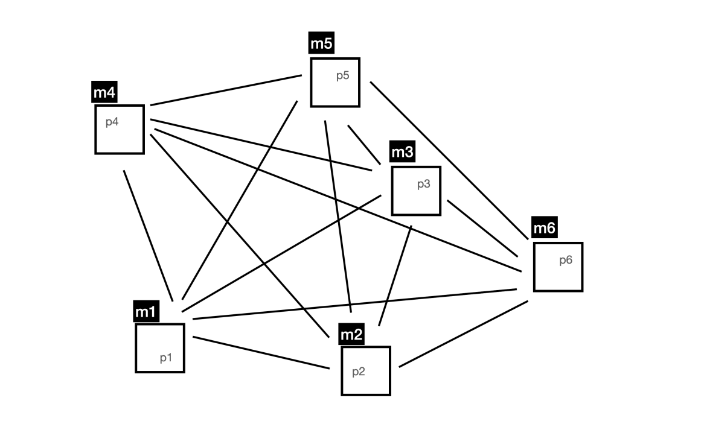

# TOTALLY ORDERED MULTICAST
### DISTRIBUTED SYSTEMS - FCUP 2024/25

---
#### Description

The setup involves a network consisting of six peers (p1 to p6), each located on a distinct machine (m1 to m6),
arranged as depicted in the provided topology.
Each peer maintains a table listing the IPs of all other peers.

Each peer incorporates Lamport clocks to ensure that messages are accurately timestamped.
Messages are generated at a frequency of one per second, following a Poisson distribution.
Peers select a random word from a set derived from an online dictionary's keywords.
These words are then sent in messages to all peers listed in the IP table.

The primary objective is for all peers to output the same sequence of words, which necessitates a consensus on the global order of messages prior to their processing.
This task is challenging due to factors like communication latency and variations in network topology, which can impact message delivery, even in smaller networks.

To address these challenges, the Totally-Ordered Multicast (TOM) Algorithm, detailed in Chapter 6 of van Steen and Tanenbaum's work, should be implemented.
This algorithm uses Lamport clocks to timestamp messages, facilitating an agreed-upon order for processing. 
It's crucial to note that while processes consistently receive incoming messages, they only process them when specific conditions are met. In this scenario, processing involves printing the words from the messages.
A correct implementation of the TOM algorithm ensures that all peers display an identical list of words.

For further insights on the mechanisms of "Lamport Clocks" and "Totally Ordered Multicast," refer to Chapter 6 in the book by van Steen & Tanenbaum.

[van Steen & Tanenbaum book](https://www.distributed-systems.net/index.php/books/ds4/) 
[How to compile and run the project](CompileAndRun.md)

#### Additional considerations regarding the outcome of my implementation of the assignment:
I consider the 'Totally Ordered Multicast' the quite challenging to implement on a p2p network.
I was able to implement the network as desired and the`Lamport Clocks` as well. Although all peers seem to be synchronized at first, I noticed that some tuning needs to be done in order for them to be fully synchronized.
The synchronization process is very challenging and I think that initializing each peer's clock with a small randomization (for example not having all peers start with the exact same clock) would significantly improve the synchronization of the peers.
This is not my case, since all clock's initial value is `0`.

Implementation details
---
#### Peer class
The peer class represents a peer in the network. It initializes the classes InPipe, OutPipe, and MessageProcessor.
It initializes an instance of InPipe in a separate thread when it receives communication from other peers.
It initializes one instance of OutPipe in a separate thread to send messages to other peers.
It initializes an instance of MessageProcessor in a separate thread to process the messages received from the InPipe.

#### InPipe class
The InPipe class is responsible for receiving messages from other peers, and funnel them into the MessageProcessor.

#### OutPipe class
The OutPipe class is responsible for extracting random words from `ds/assign/tom/peer/resources/words.txt` and sending them to other peers.
It also forwards the messages to the MessageProcessor.

#### MessageProcessor class
The MessageProcessor is a singleton responsible for receiving messages from the InPipe and OutPipe, and processing them.
It is initialized with a cold start timeout so that the PriorityQueue where the words are stored is ordered correctly.
This is where the Lamport Clock is handled.

